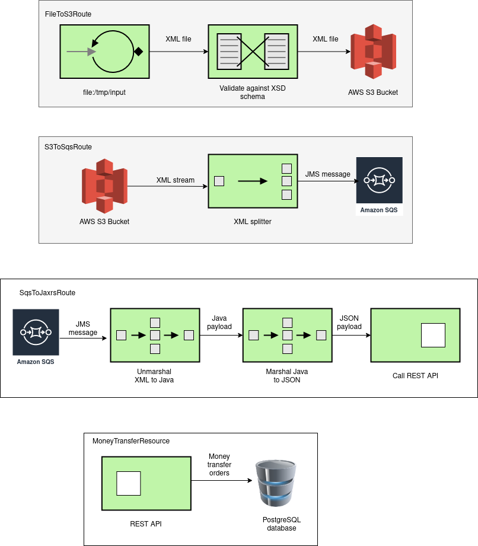
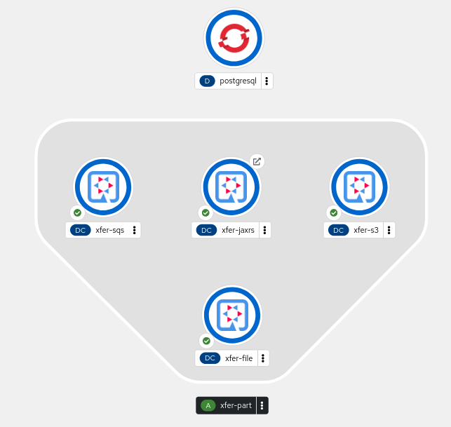
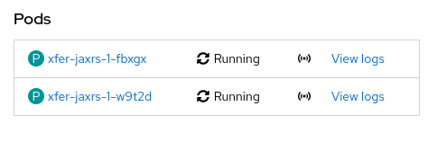

# Codeshift Hackathon

This project is provided on the purpose of being submitted to the CodeShift Hackathon contest. It shows a micro-services based application implemented using Apache Camel and Quarkus,
and deployed on Openshift Developer's Sandbox (Openshift Dedicated). The micro-services are as follows:

- ```xfer-file```: this microservice is polling the ```/tmp/input``` local folder and, as soon as an XML file is comming, it store it in an AWS S3 bucket, which name starts with ```mys3``` followed by a random suffix.
- ```xfer-s3```: this microservice is listening on the first found AWS S3 bucket which name starts with ```mys3``` and, as soon as an XML file comes in, it splits, tokenizes and streams it, before sending each message to an AWS SQS queue, which name is ```myQue```.
- ```xfer-sqs```: this microservice subscribes for messages to the AWS SQS queue named ```myQueue``` and, for each incoming message, unmarshall it from XML to Java objects, the marshal it to JSON format, before sending it to the REST service below.
- ```xfer-jaxrs```: this microservice exposes a REST API having endpoint for CRUDing money transfer orders. It consumes/produces JSON input/output data. It uses a service which exposes and interface defined by ```xfer-api``` project. Several implementations of this interface might be present but, for simplicity sake, in the current case we're using the one defined by ```xfer-provider``` project, named ```DefaultMoneyTransferProvider```, which only CRUds the money transfer order requests in an in-memory hash map.

The figure below shows the processing diagram of these micro-services.



## Deploying and running the microservices in Openshift

In order to deploy and run the miroservices in Openshift, proceed as follows:

### Login to Openshift

Here are the required steps to log in to Openshift Developer Sandbox:

- Fire your prefered browser and go to the Openshift Developer Sandbox site (https://developers.redhat.com/developer-sandbox)
- Click on the `Login` link in the upper right corner (you need to alrady have registered with the Openshift Developer Sandbox)
- Click on the red button labeled `Start your sandbox for free` in the center of the screen
- In the upper right corner, unfold your user name and click on the `Copy login command` button
- In the new dialog labeled `Log in with ...` click on the `DevSandbox` link
- A new page is displayed having a link labeled `Display Token`. Click on this link.
- Copy and execute the displayed oc command, for example

      $ oc login --token=... --server=https://api.sandbox-m3.1530.p1.openshiftapps.com:6443

### Clone the project from GitHub

Here are the steps required to clone the project:

    $ git clone https://github.com/nicolasduminil/codeshift-hackathon.git ./xfer
    $ cd xfer

### Create the Openshift secret

Here are the steps required to create the Openshift secret:

- First encode your AWS access key ID and secret access key in Base64 as follows:

      $ echo -n <your AWS access key ID> | base64
      $ echo -n <your AWS secret access key> | base64

- Edit the file `aws-secret.yaml` and amend the following lines such that to replace `...` by the Base64 encoded values:

      AWS_ACCESS_KEY_ID: ...
      AWS_SECRET_ACCESS_KEY: ...

- Create he Openshift secret containing the AWS access key ID and secret access key:

      $ oc apply -f aws-secret.yaml

### Start the microservices

In order to start the microservices, run the following script:

    $ ./start-ms.sh

This script will deploy the application on `Openshift Developer's Sandbox`. Its execution may take
sometime. Once this command finished, go to the `Openshift Developer's Sandbox` console and, in the 
`Developer` perspective, click on `Topology` in the leftmost navigation pane. You should see something like below:



### Observe the log files

In order to follow the microservices execution run the commands below:

    $ oc get pods
    $ oc logs <pod-id>

For example:

    $ oc get pods
    NAME                          READY   STATUS      RESTARTS   AGE
    postgresql-6668b8dff6-z84sd   1/1     Running     0          3m37s
    xfer-file-1-build             0/1     Completed   0          2m58s
    xfer-file-1-deploy            0/1     Completed   0          2m18s
    xfer-file-1-x5477             1/1     Running     0          2m17s
    xfer-jaxrs-1-build            0/1     Completed   0          46s
    xfer-jaxrs-1-d88fg            1/1     Running     0          6s
    xfer-jaxrs-1-deploy           0/1     Completed   0          7s
    xfer-s3-1-build               0/1     Completed   0          2m13s
    xfer-s3-1-deploy              0/1     Completed   0          95s
    xfer-s3-1-xgnht               1/1     Running     0          94s
    xfer-sqs-1-449ng              1/1     Running     0          51s
    xfer-sqs-1-build              0/1     Completed   0          90s
    xfer-sqs-1-deploy             0/1     Completed   0          52s

Here, for each micro-services, we got three running pods: a "build" one, a "deploy" one and an application one.

To look in the log file for the pod `xfer-jaxrs-1-d88fg`, for example, use the following command:

    $ oc logs xfer-jaxrs--1-d88fg --follow

In the beggining, the log file doesn't contain any relevant message.

### Observing the PostgreSQL database

To inspect the content of the associated PostgreSQL database, do the following:

    $ oc rsh postgresql-6668b8dff6-z84sd
    sh-4.4$ PGPASSWORD=xfer psql -h postgresql xferdb xfer
    psql (15.3)
    Type "help" for help.

Now we have opened a PSQL session to our database. In order to see its content, do that:

    xferdb=> \dt           
                   List of relations
    Schema |         Name          | Type  | Owner
    --------+-----------------------+-------+-------
    public | bank_accounts         | table | xfer
    public | bank_addresses        | table | xfer
    public | banks                 | table | xfer
    public | money_transfer_orders | table | xfer
    (4 rows)

The previous command displays all the tables that exist in the current schema. To browse these tables, you can use SQL statement, like for example:

    xferdb=> select * from money_transfer_orders;

But at this stage, the tables are empty.

### Triggering the Apache Camel routes

Now, that our Apache Camel route are started and listening, we need to transfer an XML file, containing money transfer orders, in the input folder. We provide a script to perform this operation:

    $ ./copy-xml-file.sh

After having ran this script, repeating the statements above will show 5 new rcords in the `money_transfer_orders` table. Also, looking in the pod log files will show relevant messages.

### Modifying the deployment config

We can interactivelly modify our DCs such that, for example, to scale the micro-services. the following command:

    $ oc scale dc xfer-jaxrs --replicas=2
    W1108 16:17:56.353206   58225 warnings.go:70] apps.openshift.io/v1 DeploymentConfig is deprecated in v4.14+, unavailable in v4.10000+
    W1108 16:17:56.449290   58225 warnings.go:70] extensions/v1beta1 Scale is deprecated in v1.2+, unavailable in v1.16+
    deploymentconfig.apps.openshift.io/xfer-jaxrs scaled

scales the REST API micro-services from 1 to 2 running instances. Now, going back to the `Openshift Developer's Sandbox`
console, clicking on `Developer -> Topology` and selecting the `xfer-jaxrs` pod, you should see something like in
the figure below:



As you can see, there are now two running instances of the `xfer-jaxrs` micro-service.

### Testing with Swagger

We have included in the project a Swagger interface in order to facilitate the REST API testing. Get the micro-service endpoint as follows:

     $ oc get routes
     NAME         HOST/PORT                                                                 PATH   SERVICES     PORT   TERMINATION   WILDCARD
     xfer-jaxrs   xfer-jaxrs-nicolasduminil-dev.apps.sandbox-m3.1530.p1.openshiftapps.com          xfer-jaxrs   http                 None

Now you can use your prefered browser to go to `http://xfer-jaxrs-nicolasduminil-dev.apps.sandbox-m3.1530.p1.openshiftapps.com/q/swagger-ui`

### Stop the microservices

In order to stop the microservices, run the following script:

    $ ./kill-ms.sh

### Cleaning up the AWS infrastructure

In order to clean up the AWS infrastructure, run the commands below:

    $ ./delete-all-buckets.sh
    $ ./purge-sqs-queue.sh
    $ ./delete-sqs-queue.sh

### Log out from Openshift

In order to log out from Openshift unfold your user name in the right upper corner and select `Log out`.